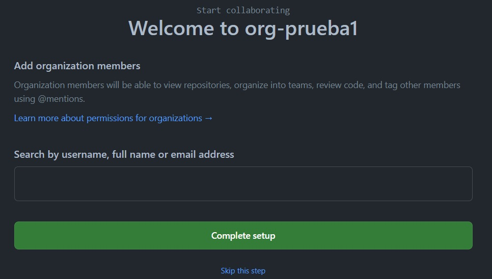
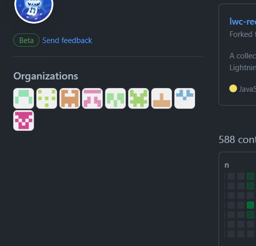

# Como crear una organización en GitHub

Vas a tu cuenta de gitHub y haces click en el icono superior de la derecha.

* Selecciona y click en : Your organizations  
  

***

* Click en el botón: New organization  
  

***

* Click en el botón: Create a free organization  
  

***

* Completas con un nombre para la organización que vas a crear y tu email.  
* Seleccionas: My personal account  
  

***

* Te pide una verificación y check de aceptación.  
* Click en Next  
  

***

* Aquí podes saltar este paso: Skip this step  
  

***

* En la página siguiente podes dejar todo como esta o completar a gusto.  
* y haces click en el botón: Submit  
  

***

* Listo ya tenes creada la organización.  
* Con el botón de la derecha al medio ya podes crear un nuevo repositorio dentro de la organizacion.  
* Y podes setear la organización a tu gusto.  

***  

* En tu profile a la izquierda vas a encontrar el icono de tu organización.  
  

***
Espero les ayude. Saludos.  
