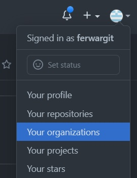

# Como crear una organización en GitHub
Vas a tu cuenta de gitHub y haces click en el icono superior de la derecha.
* Selecciona y click en : Your organizations  
  
***
* Click en: New organization  
  
***
* Click en: Create a free organization  
  
***
* Completas con el nombre de la organización y tu email.  
* Seleccionas: My personal account  
  
***
* Te pide una verificación y check de casilla.  
* Click en Next  
  
***
* Aquí podes saltar este paso: Skip this step  
  
***
* En la página siguiente podes dejar todo como esta o completar a gusto  
* y haces click en: Submit  
  
***
* Listo ya tenes creada la organizacion  
* Con el botón de la derecha al medio ya podes crear un nuevo repositorio dentro de la organizacion.  
* Y podes setear la organización a tu gusto.  

***  
* En tu profile a la izquierda vas a encontrar el icono de tu organización.  
  
***
